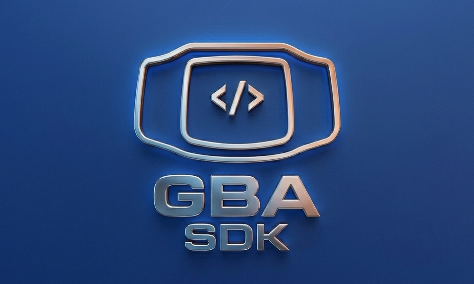

[![Contributors][contributors-shield]][contributors-url]
[![Forks][forks-shield]][forks-url]
[![Stargazers][stars-shield]][stars-url]
[![Issues][issues-shield]][issues-url]
[![MIT License][license-shield]][license-url]

<br />
<div align="center">
  <a href="https://github.com/lukas-sgx/">
    
  </a>

  <h3 align="center">GameBoy Advance - SDK</h3>

  <p align="center">
    A Software Development Kit for developers who want to build GameBoy Advance games.
    <br />
    <a href="https://github.com/lukas-sgx/GBA-sdk"><strong>Explore the docs »</strong></a>
    <br />
    <br />
    <a href="https://github.com/lukas-sgx/GBA-sdk">View Demo</a>
    &middot;
    <a href="https://github.com/lukas-sgx/GBA-sdk/issues/new?labels=bug&template=bug-report---.md">Report Bug</a>
    &middot;
    <a href="https://github.com/lukas-sgx/GBA-sdk/issues/new?labels=enhancement&template=feature-request---.md">Request Feature</a>
  </p>
</div>

<details>
  <summary>Table of Contents</summary>
  <ol>
    <li>
      <a href="#about-the-project">About The Project</a>
      <ul>
        <li><a href="#built-with">Built With</a></li>
      </ul>
    </li>
    <li>
      <a href="#getting-started">Getting Started</a>
      <ul>
        <li><a href="#prerequisites">Prerequisites</a></li>
        <li><a href="#installation">Installation</a></li>
      </ul>
    </li>
    <li><a href="#usage">Usage</a></li>
    <li><a href="#roadmap">Roadmap</a></li>
    <li><a href="#contributing">Contributing</a></li>
    <li><a href="#license">License</a></li>
    <li><a href="#contact">Contact</a></li>
    <li><a href="#acknowledgments">Acknowledgments</a></li>
  </ol>
</details>

## About The Project

This SDK aims to simplify GameBoy Advance homebrew development by allowing developers to write game logic in Python. It handles the underlying compilation, asset conversion, and bindings to interface efficiently with the GBA hardware.

### Built With

[![Python][Python-shield]][Python-url]

## Getting Started

To get a local copy up and running, follow these simple steps.

### Prerequisites

You need Python 3.x installed on your system

### Installation

1. Clone the repo

```sh
   git clone https://github.com/lukas-sgx/GBA-sdk.git
```

2. Install the SDK in development mode

```sh
   pip install -e .
```

## Usage

Here is a quick example of how to check if header is valid:
```sh
cartridge hdr dump Super_Mario_Advance.gba
Super_Mario_Advance.gba:
|-- entry
|   |-- valid: True
|   |-- raw: 0xea00002e
|   `-- opcode: b 0xc0
|-- nintendo logo:
|   |-- status: True
|   `-- debugging: True
|-- game title: SUPER MARIOB
|-- game code:
|   |-- code: AA2E
|   |-- date: 2001..2003 (old)
|   `-- language: USA/English
|-- marker code:
|   |-- id: 01
|   `-- developer: Nintendo
|-- fixed value: valid (96h)
|-- unit code: 00h
|-- device type: 00h
|-- reserved: valid
|-- software_ver: 00h
`-- checksum:
    |-- valid: True
    |-- rom: 8e
    `-- our: 8e
```

*For more advanced examples, please refer to the [Documentation](https://github.com/lukas-sgx/GBA-sdk).*


## Roadmap

- [x] Automated header checker `.gba` ROM
- [ ] Automated compilation to `.gba` ROM
- [ ] Core GBA bindings (Video, Audio, Inputs)
- [ ] Asset pipeline (PNG to GBA sprite palette converter)

See the [open issues](https://github.com/lukas-sgx/GBA-sdk/issues) for a full list of proposed features (and known issues).


## Contributing

Contributions are what make the open-source community such an amazing place to learn, inspire, and create. Any contributions you make are **greatly appreciated**.

1. Fork the Project
2. Create your Feature Branch (`git checkout -b feature/AmazingFeature`)
3. Commit your Changes (`git commit -m 'Add some AmazingFeature'`)
4. Push to the Branch (`git push origin feature/AmazingFeature`)
5. Open a Pull Request

### Top contributors:

<a href="https://github.com/lukas-sgx/GBA-sdk/graphs/contributors">
  
</a>

## License

Distributed under the MIT License. See [LICENSE](./LICENSE) for more information.

## Contact

Lukas Soigneux - lukas.soigneux@epitech.eu

## Acknowledgments

* [GBATEK](https://mgba-emu.github.io/gbatek/) - GameBoy Advance Technical Info
* [Ayyboy-Advance](https://github.com/YannMagnin/ayyboy-advance) - Great emulator for testing

[contributors-shield]: https://img.shields.io/github/contributors/lukas-sgx/GBA-sdk.svg?style=for-the-badge
[contributors-url]: https://github.com/lukas-sgx/GBA-sdk/graphs/contributors
[forks-shield]: https://img.shields.io/github/forks/lukas-sgx/GBA-sdk.svg?style=for-the-badge
[forks-url]: https://github.com/lukas-sgx/GBA-sdk/network/members
[stars-shield]: https://img.shields.io/github/stars/lukas-sgx/GBA-sdk.svg?style=for-the-badge
[stars-url]: https://github.com/lukas-sgx/GBA-sdk/stargazers
[issues-shield]: https://img.shields.io/github/issues/lukas-sgx/GBA-sdk.svg?style=for-the-badge
[issues-url]: https://github.com/lukas-sgx/GBA-sdk/issues
[license-shield]: https://img.shields.io/github/license/lukas-sgx/GBA-sdk.svg?style=for-the-badge
[license-url]: https://github.com/lukas-sgx/GBA-sdk/blob/master/LICENSE.txt

[Python-shield]: https://img.shields.io/badge/Python-3776AB?style=for-the-badge&logo=python&logoColor=white
[Python-url]: https://www.python.org/